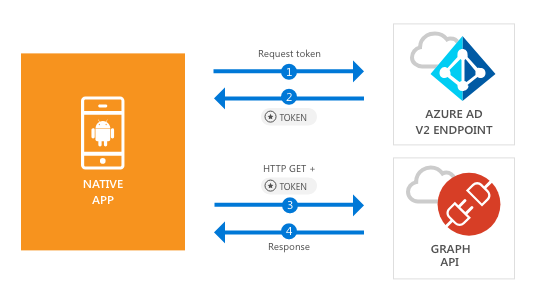

# Quickstart: Sign in users and call the Microsoft Graph API from an Android app

This quickstart contains a code sample that demonstrates how a native Android application can sign in personal, work and school accounts, get an access token, and call the Microsoft Graph API.



> [!NOTE]
> **Prerequisites**
> * Android Studio
> * Android SDK 21 or later is required (SDK 25 is recommended)
> * An Android device with Google Chrome or a web browser with support for Custom Tabs is required for this release of MSAL for Android

> [!div renderon="docs"]
> ## Register your application and download your quickstart app
> You have two options to start your quickstart application:
> * [Express] [Option 1: Register and auto configure your app and then download your code sample](#option-1-register-and-auto-configure-your-app-and-then-download-your-code-sample)
> * [Manual] [Option 2: Register and manually configure your application and code sample](#option-2-register-and-manually-configure-your-application-and-code-sample)
>
> ### Option 1: Register and auto configure your app and then download your code sample
>
> 1. Go to the [Azure portal - Application Registration](https://portal.azure.com/signin/index/?Microsoft_AAD_RegisteredApps=true#blade/Microsoft_AAD_RegisteredApps/applicationsListBlade/quickStartType/androidQuickstartPage/sourceType/docs).
> 1. Enter a name for your application and click **Register**.
> 1. Follow the instructions to download and automatically configure your new application for you in one click.
> [!div renderon="docs"]
> ### Option 2: Register and manually configure your application and code sample
> #### Step 1: Register your application
> 
> 1. To register an application, go to the [Azure portal - Application Registration [Prod]](https://aka.ms/registeredappsprod) and select **New registration**.
> 1. Enter a name for your application and click **Register**.
> 1. Select the **Authentication** page, then add `msal{AppId}://auth` (where *{AppId}* is the application ID from the application you just registered), select **Installed client** under **Type**, and then select **Save**.
>
>> [!TIP]
>> To know the *Application ID*, go to Overview page.

> [!div renderon="portal" class="sxs-lookup"]
> ### Step 1: Configure your application
> For the code sample for this quickstart to work, you need to add a reply URL as **msal{AppId}://auth** (where {AppId} is the application ID of your app).
> > [!div renderon="portal" id="makechanges" class="nextstepaction"]
> > [Make this change for me]()
>
> > [!div id="appconfigured" class="hidden"]
> >  Your application is configured with these attributes

#### Step 2: Download your web server or project

* [Download the Android Studio Project](https://github.com/Azure-Samples/active-directory-android-native-v2/archive/master.zip)

#### Step 3: Configure your project

1. Extract and open the project in Android Studio.
1. Under **app** > **java** > **<i>{host}.{namespace}</i>**, open **MainActivity**.
1. Replace the line starting with `final static String CLIENT_ID` with the following code:

    ```java
    final static String CLIENT_ID = "[Enter the application Id here]";
    ```
1. Open: **app** > **manifests** > **AndroidManifest.xml**.
1. Add the following activity to the **manifest\application** node. This code snippet registers a **BrowserTabActivity** to allow the OS to resume your application after completing the authentication:

    ```xml
    <!--Intent filter to capture System Browser calling back to our app after Sign In-->
    <activity
        android:name="com.microsoft.identity.client.BrowserTabActivity">
        <intent-filter>
            <action android:name="android.intent.action.VIEW" />
            <category android:name="android.intent.category.DEFAULT" />
            <category android:name="android.intent.category.BROWSABLE" />
    
            <!--Add in your scheme/host from registered redirect URI-->
            <!--By default, the scheme should be similar to 'msal[appId]' -->
            <data android:scheme="msalEnter_the_Application_Id_here"
                android:host="auth" />
        </intent-filter>
    </activity>
    ```
> [!div renderon="docs"]
> 6. Replace `Enter_the_Application_Id_here` with the Application ID your application

## More Information

Read the following sections for more info about this quickstart.

### MSAL

MSAL ([com.microsoft.identity.client](http://javadoc.io/doc/com.microsoft.identity.client/msal)) is the library used to sign in users and request tokens used to access an API protected by Microsoft Azure Active Directory (Azure AD). You can use carthage to install it by adding the following in **Gradle Scripts** > **build.gradle (Module: app)** under **Dependencies**:

```ruby  
compile ('com.microsoft.identity.client:msal:0.1.+') {
    exclude group: 'com.android.support', module: 'appcompat-v7'
}
compile 'com.android.volley:volley:1.0.0'
```

### MSAL initialization

You can add the reference for MSAL by adding the following code:

```java
import com.microsoft.identity.client.*;
```

Then, initialize MSAL using the following code:

```java
sampleApp = new PublicClientApplication(
        this.getApplicationContext(),
        CLIENT_ID);
```

> |Where: ||
> |---------|---------|
> |`CLIENT_ID` | The Application ID from the application registered in *portal.microsoft.com* |

### Requesting tokens

MSAL has two methods used acquire tokens: `acquireToken` and `acquireTokenSilentAsync`

#### Getting a user token interactively

Some situations require forcing users to interact with Azure AD v2.0 endpoint, which results in a context switch to the system browser to either validate the users's credentials or for consent. Some examples include:

* The first time users sign in to the application
* When users may need to reenter their credentials because the password has expired
* When your application is requesting access to a resource that the user needs to consent to
* When two factor authentication is required

```java
sampleApp.acquireToken(this, SCOPES, getAuthInteractiveCallback());
```

> |Where:||
> |---------|---------|
> | `SCOPES` | Contains the scopes being requested (that is, `{ "user.read" }` for Microsoft Graph or `{ "api://<Application ID>/access_as_user" }` for custom Web APIs) |
> | `getAuthInteractiveCallback` | Callback executed when control is given back to the application after authentication |

#### Getting a user token silently

You don't want to require user to validate their credentials every time they need to access a resource. Most of the time you want token acquisitions and renewal without any user interaction. You can use `AcquireTokenSilentAsync` method to obtain tokens to access protected resources after the initial `acquireToken` method:

```java
sampleApp.acquireToken(getActivity(), SCOPES, getAuthInteractiveCallback());
```

> |Where:||
> |---------|---------|
> | `SCOPES` | Contains the scopes being requested (that is, `{ "user.read" }` for Microsoft Graph or `{ "api://<Application ID>/access_as_user" }` for custom Web APIs) |
> | `getAuthInteractiveCallback` | Callback executed when control is given back to the application after authentication |

## Next steps

Try out the Android tutorial for a complete step-by-step guide on building applications and new features, including a full explanation of this quickstart.

### Learn the steps to create the application used in this Quickstart

> [!div class="nextstepaction"]
> [Call Graph API Android tutorial](https://docs.microsoft.com/azure/active-directory/develop/guidedsetups/active-directory-android)

[!INCLUDE [Help and support](../../../../includes/active-directory-develop-help-support-include.md)]
