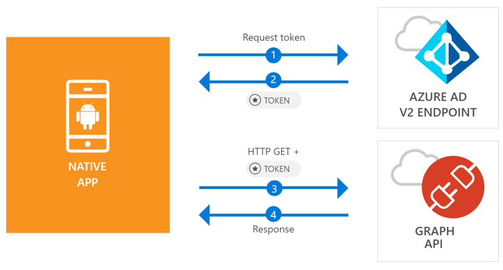

# Sign in users and call the Microsoft Graph API from an Android app

This quickstart contains a code sample that demonstrates how a native Android application can sign in personal, work and school accounts, get an access token, and call the Microsoft Graph API.



> [!NOTE]
> ## Prerequisites
> * Android Studio 
> * Android SDK 21 or later is required (SDK 25 is recommended).
> * Google Chrome or a web browser that uses Custom Tabs is required for this release of MSAL for Android.

> [!div renderon="docs"]
> ## Step 1: Register your application
> 
> 1. To register an application, go to the [Azure AD - Application Registration](https://apps.dev.microsoft.com/portal/register-app)
> 1. Enter a name for your application and click **Create**
> 1. Follow the instructions to configure your application and add **msal{AppId}://auth** in the list of redirect URLs.

> [!div renderon="portal" class="sxs-lookup"]
> ## Step 1: Configure your application
> For the code sample for this quickstart to work, you need to add a reply URL as **msal{AppId}://auth** (where l{AppId} is this application Id).
> > [!div renderon="portal" id="makechanges" class="nextstepaction"]
> > [Make this change for me]()
>
> > [!div id="appconfigured" class="hidden"]
> >  Your application is configured with these attributes

## Step 2: Download your web server or project

- [Download the Android Studio Project](https://github.com/Azure-Samples/active-directory-android-native-v2/archive/master.zip)

## Step 3: Configure your project

1. Extract and open the Project in Android Studio
1. Open **MainActivity** (under **app** > **java** > **<i>{host}.{namespace}</i>**)
1. Replace the line starting with `final static String CLIENT_ID` with:

    ```java
    final static String CLIENT_ID = "[Enter the application Id here]";
    ```
1. Open: **app** > **manifests** > **AndroidManifest.xml**
1. Add the following activity to **manifest\application** node. This register a **BrowserTabActivity** to allow the OS to resume your application after completing the authentication:

    ```xml
    <!--Intent filter to capture System Browser calling back to our app after Sign In-->
    <activity
        android:name="com.microsoft.identity.client.BrowserTabActivity">
        <intent-filter>
            <action android:name="android.intent.action.VIEW" />
            <category android:name="android.intent.category.DEFAULT" />
            <category android:name="android.intent.category.BROWSABLE" />
    
            <!--Add in your scheme/host from registered redirect URI-->
            <!--By default, the scheme should be similar to 'msal[appId]' -->
            <data android:scheme="msal[Enter the application Id here]"
                android:host="auth" />
        </intent-filter>
    </activity>
    ```

## More Information

Below an overview of this Quickstart:

### MSAL

MSAL ([com.microsoft.identity.client](http://javadoc.io/doc/com.microsoft.identity.client/msal)) is the library used to sign in users and request tokens used to access an API protected by Microsoft Azure Active Directory. You can use carthage to install it by adding the following in **Gradle Scripts** > **build.gradle (Module: app)** under **Dependencies**:

```ruby  
compile ('com.microsoft.identity.client:msal:0.1.+') {
    exclude group: 'com.android.support', module: 'appcompat-v7'
}
compile 'com.android.volley:volley:1.0.0'
```

### MSAL Initialization

You can add the reference for MSAL by adding the line below:

```java
import com.microsoft.identity.client.*;
```

Then initialize MSAL using the line below:

```java
sampleApp = new PublicClientApplication(
        this.getApplicationContext(),
        CLIENT_ID);
```

> |Where: ||
> |---------|---------|
> |clientId | The Application Id from the application registered in *portal.microsoft.com* |

### Requesting tokens

Msal has two methods used acquire tokens - `acquireToken` and `acquireTokenSilentAsync`:

#### Getting a user token interactively

 Some situations require forcing users interact with Azure Active Directory v2 endpoint which will result a context switch to the system browser, to either validate users's credentials or for consent – some examples include:

* The first time users signs-in to the application
* Users may need to reenter their credentials because the password has expired
* Your application is requesting access to a resource that the user needs to consent to
* Two factor authentication is required

```java
sampleApp.acquireToken(this, SCOPES, getAuthInteractiveCallback());
```

> |Where:||
> |---------|---------|
> |SCOPES | Contains the scopes being requested (i.e. `{ "user.read" }` for Microsoft Graph or `{ "api://<Application ID>/access_as_user" }` for custom Web APIs) |
> |getAuthInteractiveCallback | Callback executed when control is given back to the application after authentication |

#### Getting a user token silently

You don't want to require user to validate their credentials every time they need to access a resource - most of the time you want token acquisitions and renewal without any user interaction - `AcquireTokenSilentAsync` is the method commonly used to obtain tokens used to access protected resources after the initial `acquireToken`:

```java
sampleApp.acquireToken(getActivity(), SCOPES, getAuthInteractiveCallback());
```

> |Where:||
> |---------|---------|
> |SCOPES | Contains the scopes being requested (i.e. `{ "user.read" }` for Microsoft Graph or `{ "api://<Application ID>/access_as_user" }` for custom Web APIs) |
> |getAuthInteractiveCallback | Callback executed when control is given back to the application after authentication |

## What is next

Try out the Android tutorial for a complete step-by-step guide on building applications and building new features, including a full explanation of this Quickstart:

### Learn the steps to create the application used in this Quickstart

> [!div class="nextstepaction"]
> [Call Graph API Android tutorial](https://docs.microsoft.com/azure/active-directory/develop/guidedsetups/active-directory-android)

[!INCLUDE [Help and support](../../../../includes/active-directory-develop-help-support-include.md)]