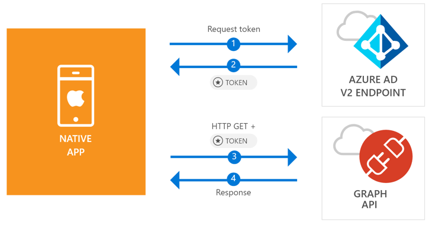

# Quickstart: Sign in users and call the Microsoft Graph API from an iOS native app

This quickstart contains a code sample that demonstrates how a native iOS application can sign in personal, work and school accounts, get an access token, and call the Microsoft Graph API.




> [!div renderon="docs"]
> ## Register your application and download your quickstart app
> You have two options to start your quickstart application:
> * [Express] [Option 1: Register and auto configure your app and then download your code sample](#option-1-register-and-auto-configure-your-app-and-then-download-your-code-sample)
> * [Manual] [Option 2: Register and manually configure your application and code sample](#option-2-register-and-manually-configure-your-application-and-code-sample)
>
> ### Option 1: Register and auto configure your app and then download your code sample
>
> 1. Go to the [Azure portal - Application Registration](https://portal.azure.com/signin/index/?Microsoft_AAD_RegisteredApps=true#blade/Microsoft_AAD_RegisteredApps/applicationsListBlade/quickStartType/iosQuickstartPage/sourceType/docs).
> 1. Enter a name for your application and click **Register**.
> 1. Follow the instructions to download and automatically configure your new application for you in one click.
> [!div renderon="docs"]
> ### Option 2: Register and manually configure your application and code sample
> #### Step 1: Register your application
> 
> 1. To register an application, go to the [Azure portal - Application Registration [Prod]](https://aka.ms/registeredappsprod) and select **New registration**.
> 1. Enter a name for your application and click **Register**.
> 1. Select the **Authentication** page, then add `msal{AppId}://auth` (where *{AppId}* is the application ID from the application you just registered), select **Installed client** under **Type**, and then select **Save**.
>
>> [!TIP]
>> To find the *Application ID*, go to Overview page.

> [!div renderon="portal" class="sxs-lookup"]
> ### Step 1: Configure your application
> For the code sample for this quickstart to work, you need to add a reply URL as **msal{AppId}://auth** (where l{AppId} is this application Id).
> > [!div renderon="portal" id="makechanges" class="nextstepaction"]
> > [Make this change for me]()
>
> > [!div id="appconfigured" class="hidden"]
> >  Your application is configured with this attribute

## Step 2: Download your web server or project

- [Download the XCode Project](https://github.com/Azure-Samples/active-directory-ios-swift-native-v2/archive/master.zip)

## Step 3: Configure your project

1. Extract the zip file and open the project in XCode.
1. Edit **ViewController.swift** and replace the line starting with 'let kClientID' with the following code snippet:

    ```csharp
    private static string ClientId = "Enter_the_Application_Id_here";
    ```
1. Press Control + click **Info.plist** to bring up the contextual menu, and then select **Open As** > **Source Code**.
1. Under the dict root node, add the following code:

    ```xml
    <key>CFBundleURLTypes</key>
    <array>
        <dict>
            <key>CFBundleTypeRole</key>
            <string>Editor</string>
            <key>CFBundleURLName</key>
            <string>$(PRODUCT_BUNDLE_IDENTIFIER)</string>
            <key>CFBundleURLSchemes</key>
            <array>
                <string>msal[Your_Application_Id_Here]</string>
                <string>auth</string>
            </array>
        </dict>
    </array>
    ```

## More Information

Read these sections to learn more about this quickstart.

### MSAL

MSAL ([MSAL.framework](https://github.com/AzureAD/microsoft-authentication-library-for-objc)) is the library used to sign in users and request tokens used to access an API protected by Microsoft Azure Active Directory. You can use carthage to install it by first running the following command in bash terminal from App’s root folder to build MSAL:

```bash
echo "github \"AzureAD/microsoft-authentication-library-for-objc\" \"master\"" > Cartfile
carthage update
```

Then, in XCode, open the **General**, go to **Linked Frameworks and Libraries** and add **MSAL.framework** in **Add other...**, then add the following content in **New Run Script Phase**:

```text
/usr/local/bin/carthage copy-frameworks
```

And the following to **Input Files**:

```text
$(SRCROOT)/Carthage/Build/iOS/MSAL.framework
```

### MSAL initialization

You can add the reference for MSAL by adding the following code:

```swift
import MSAL
```

Then, initialize MSAL using the following code:

```swift
self.applicationContext = try MSALPublicClientApplication.init(clientId: kClientID, authority: kAuthority)
```

> |Where: ||
> |---------|---------|
> | `clientId` | The Application ID from the application registered in *portal.microsoft.com* |
> | `authority` | The Azure AD v2.0 endpoint. In most of cases this will be *https<span/>://login.microsoftonline.com/common/v2.0* |

### Requesting tokens

MSAL has two methods used acquire tokens: `acquireToken` and `acquireTokenSilent`.

#### Getting a user token interactively

Some situations require forcing users to interact with Azure Active Directory (Azure AD) v2.0 endpoint which will result in a context switch to the system browser to either validate users's credentials or for consent. Some examples include:

* The first time users sign in to the application
* When users may need to reenter their credentials because the password has expired
* When your application is requesting access to a resource that the user needs to consent to
* When two factor authentication is required

```swift
self.applicationContext.acquireToken(forScopes: self.kScopes)
```

> |Where:||
> |---------|---------|
> | `forScopes` | Contains the scopes being requested (that is, `{ "user.read" }` for Microsoft Graph or `{ "api://<Application ID>/access_as_user" }` for custom Web APIs) |

#### Getting a user token silently

You don't want to require the user to validate their credentials every time they need to access a resource. Most of the time you want token acquisitions and renewal without any user interaction. You can use the `AcquireTokenSilentAsync`method to obtain tokens to access protected resources after the initial `AcquireTokenAsync` method:

```swift
self.applicationContext.acquireTokenSilent(forScopes: self.kScopes, user: applicationContext.users().first)
```

> |Where: ||
> |---------|---------|
> | `forScopes` | Contains the scopes being requested (that is, `{ "user.read" }` for Microsoft Graph or `{ "api://<Application ID>/access_as_user" }` for custom Web APIs) |
 | `applicationContext.users().first` | The first user in the cache (MSAL supports multiple users in a single app) |

## Next steps

Try out the iOS tutorial for a complete step-by-step guide on building applications and new features, including a full explanation of this quickstart.

### Learn the steps to create the application used in this quickstart

> [!div class="nextstepaction"]
> [Call Graph API iOS tutorial](https://docs.microsoft.com/azure/active-directory/develop/guidedsetups/active-directory-ios)

[!INCLUDE [Help and support](../../../../includes/active-directory-develop-help-support-include.md)]
