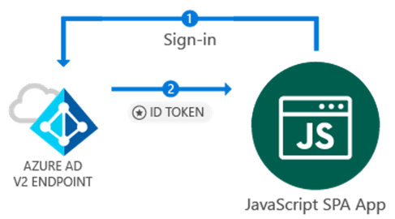

# JavaScript Single Page Application (SPA) tutorial - Sign-in

This tutorial demonstrates how a JavaScript Single Page Application (SPA) can sign in personal, work and school accounts. SPA applications require users to sign-in to get an access token, and call the Microsoft Graph API or other APIs that require access tokens from the Azure Active Directory v2 endpoint.



## Before you start
Before you start with this tutorial, you should have an understanding of the following tutorials:

> [!div class="checklist"]
> * [Intro & Setup](active-directory-javascriptspa-intro.md) 
> * [Register an app](active-directory-javascriptspa-register-app.md) 

The tutorials above generate a project containing source code and configuration. You can skip these steps above if you prefer to download the code sample generated by these previous tutorials:

## Download

If you prefer to download the project for this tutorial, you have complete two steps:

### First step: Download the code sample for this tutorial

<table>
<tr>
<td>
<h4>Option 1: Download the pre-requisites</h4>
Download the pre-requisites for this tutorial, then complete the steps for this tutorials to finish it:
<ul>
<li>
[Visual Studion 2017 project: Blank project](https://github.com/Azure-Samples/active-directory-javascript-graphapi-v2/archive/VisualStudio.zip) <br/> - or - 
</li><li>
[Python: Blank project](https://github.com/Azure-Samples/active-directory-javascript-graphapi-v2/archive/core.zip)
</li>
</ul>
</td>
<td>
<h4>Option 2: Download the complete sample</h4>
Download the complete sample, which includes the code for this tutorial:

<ul>
<li>
[Visual Studion 2017 project: Sign-in](https://github.com/Azure-Samples/active-directory-javascript-graphapi-v2/archive/VisualStudio.zip) <br/> - or - 
</li><li>
[Python: Sign-in](https://github.com/Azure-Samples/active-directory-javascript-graphapi-v2/archive/core.zip)
</li>
</ul>
</td>
</table>

### Second Step: Configure the code sample

Register an application in App Registration Portal, and then configure the code sample:

* [Register an app](active-directory-javascriptspa-register-app.md) 


## Create your single page application’s UI
1.	Create an *index.html* file for your JavaScript SPA. If you are using Visual Studio, select the project (project root folder), right click and select: `Add` > `New Item` > `HTML page` and name it index.html
2.	Add the following code to your page:

[!code-html[main](../../../../active-directory-javascript-graphapi-v2/JavaScriptSPA/index.html "index.html")]

## Initialize Microsoft Authentication Library (MSAL) and handle user experience

1.	Create a file named `app.js`. If you are using Visual Studio, select the project (project root folder), right click and select: `Add` > `New Item` > `JavaScript File`:
2.	Add the following code to your `app.js` file:

[!code-javascript[main](../../../../active-directory-javascript-graphapi-v2/JavaScriptSPA/app.js?name=initialize&highlight=2-4 "app.js")]


## Sign-in the user

Add the following code to your `app.js` file:

[!code-javascript[main](../../../../active-directory-javascript-graphapi-v2/JavaScriptSPA/app.js?name=signin "app.js")]

### More Information

After a user clicks the *‘Sign-in with Microsoft’* button for the first time, `loginPopup` will pop-up a window to to sign in the user. This method results in redirecting the user to the *Microsoft Azure Active Directory v2 endpoint* to prompt and validate the user's credentials. As a result of a successful sign-in, and a token is received, processed by `msal.js` and the information contained in the token is cached. This token is known as the *ID token* and contains basic information about the user, such as the user display name. If you plan to use any data provided by this token for any purposes, you need to make sure this token is validated by your backend server to guarantee that the token was issued to a valid user for your application.

## Test your application

> ### Testing with Visual Studio
> If you are using Visual Studio, press `F5` to run your project: the browser opens and directs you to *http://localhost:{port}* where you see the *Call Microsoft Graph API* button.

<p/><!-- -->

> ### Testing with Python or another web server
> If you are not using Visual Studio, make sure your web server is started and it is configured to listen to a TCP port based on the folder containing your *index.html* file. For Python, you can start listening to the port by running the in the command prompt/ terminal, from the app's folder:
> 
> ```bash
> python -m http.server 8080
> ```
>  Then, open the browser and type *http://localhost:8080* or *http://localhost:{port}* - where the *port* corresponds to the port that your web server is listening to. You should see the contents of your index.html page with the *Call Microsoft Graph API* button.

### Sign-in with a username and password

After the browser loads your *index.html*, click the *Sign-in* button. If this is the first time, the browser redirects you to the Microsoft Azure Active Directory v2 endpoint, where you are  prompted to sign in:


Sign-in with your username and password.

### Consent

The very first time you sign in to your application, you are presented with a consent screen similar to the following, where you need to accept:

## What is next

Now that you signed in a user, select one of the options below to proceed

> [!div class="nextstepaction"]
> [Call the Microsoft Graph API](active-directory-javascriptspa-call-graph-api.md) [Sign-out](active-directory-javascriptspa-sign-out.md)